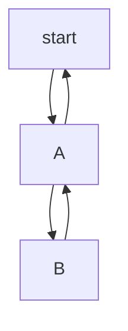
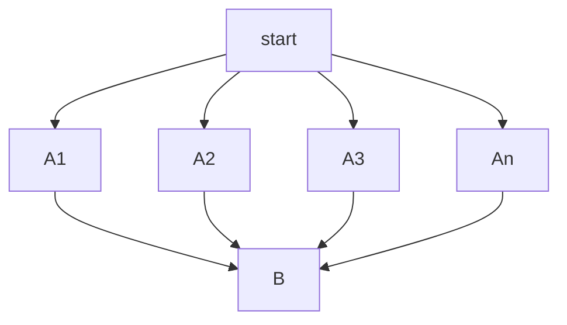

## 1. 基础知识

### 1.1 条件概率

一个事件概率依赖于另外一个事件(已发生)的度量。

$P(B|A)$的意义是在A发生的情况下B事件发生的概率。这就是条件概率。

$P(AB) = P(A) \times P(B|A)​$ 代表的意义是，AB事件同时发生的概率等于事件A发生的概率乘以在A发生条件下B事件发生的概率。

$$
P(B|A)=\frac{P(AB)}{P(A)}
$$

事件序列发生且彼此相互依赖，所以才有条件概率，这是前提。如果A, B两个事件没有相互依赖关系，那么就是独立事件。在独立事件的情况下，两个事件不会相互影响对方。A,B互为独立事件
$$
P(B|A)=P(B)
$$

### 1.2 全概率定律

事件A1，A2，A3，...... A是相互排斥的，不能同时发生。若事件A1，A2，…构成一个完备事件组且都有正概率，则对任意一个事件B，有如下公式成立：

$$
P(B) = P(BA_1)+P(BA_2)+...+P(BA_n) \\  =P(B|A_1)P(A_1) + P(B|A_2)P(A_2) + ... + P(B|A_n)P(A_n)
$$

### 1.3 贝叶斯定理

最简单形式：

> 后验概率 = 修正因子 x 先验概率 

$$
P(A|B)=\frac{P(B|A)}{P(B)}\times P(A)
$$

$$
P(A_i|B) = \frac{P(B|A_i)\times P(A_i)}{\sum_1^{n}P(A_i)\times P(B|A_i)}
$$

### 1.4 极大似然估计

> 极大似然估计是概率论中一个很常用的估计方法，在机器学习中的逻辑回归中就是基于它计算的损失函数

极大似然估计是基于一个理论：**概率最大的事件，最可能发生**

**极大似然估计（maximum likelihood estimation, MLE），通俗的说就是 —— 最像估计法（最可能估计法）**

极大似然原理与数学表示:   有n个实验结果，$A_i$到$A_n$，如果$A_j$发生了，则意味着$A_j$发生的概率最大。**即，一次试验就发生的事件，这个事件本身发生概率最大**

