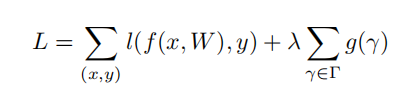
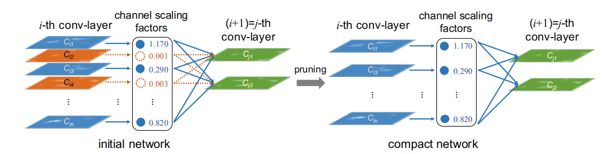
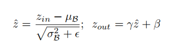
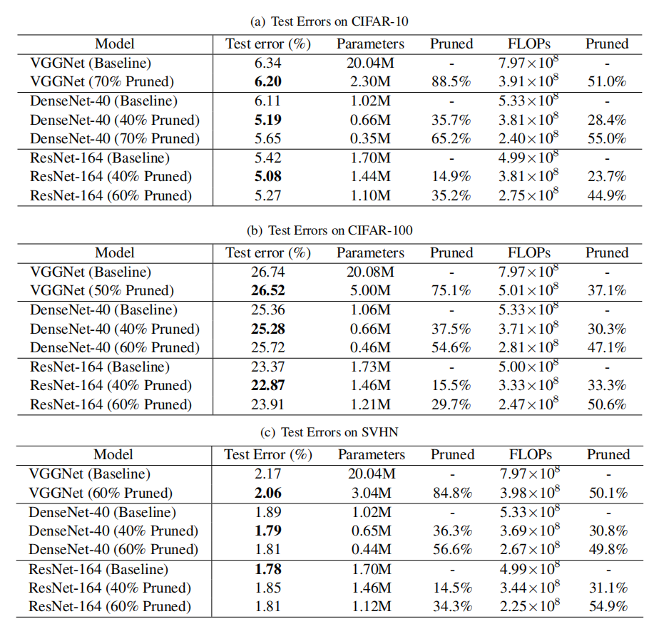
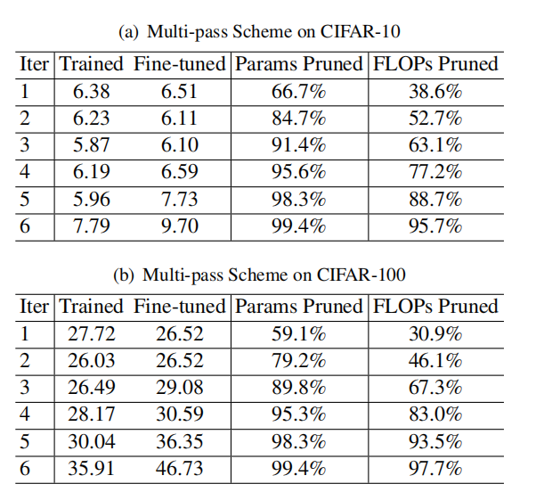
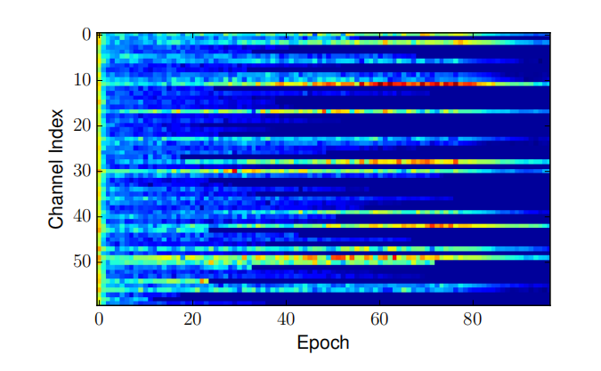

[TOC]

## 1. 摘要

在许多实际应用中部署深度卷积神经网络在很大程度上受到其高计算成本的阻碍。本文提出了一种新的CNN学习方案，以同时达到

1. 减小模型大小; 

2. 减少运行时内存占用;

3. 降低计算操作次数，同时不影响准确性。

这是通过以简单但有效的方式在网络中实施信道级稀疏性来实现的。与许多现有方法不同，所提出的方法直接应用于现代CNN架构，为训练过程引入最小开销，并且不需要用于所得模型的特殊软件/硬件加速器。我们将我们的方法称为**网络瘦身**，它将广泛和大型网络作为输入模型，但在训练过程中，自动识别和修剪了无关紧要的通道，从而产生具有相当精度的薄而紧凑的模型。我们通过各种图像分类数据集，在几个最先进的CNN模型（包括VGGNet，ResNet和DenseNet）上凭经验证明了我们方法的有效性。对于VGGNet，网络瘦身的多次通过版本可使模型尺寸减少20倍，计算操作减少5倍。

## 2. 简介

近年来，卷积神经网络（CNN）已成为各种计算机视觉任务的主要方法，例如图像分类，物体检测，语义分割大规模数据集，高端现代GPU和新的网络架构允许开发前所未有的大型CNN模型。例如，从AlexNet ，VGGNet 和GoogleNet 到ResNets ，ImageNet Classification Challenge获胜者模型已经从8层发展到超过100层。然而，更大的CNN虽然具有更强的代表能力，但更需要资源。例如，152层ResNet 有超过6000万个参数，并且在推断分辨率为224×224的图像时需要超过20个GFLOP。在资源有限的平台上，例如移动设备，可穿戴设备或物联网（IoT）设备，这种情况不太可能实现。

CNN在实际应用中的部署主要受到以下因素的限制：

1. 模型大小：CNN的强大表现力来自其数百万可训练参数。这些参数以及网络结构信息需要存储在磁盘上并在推理期间加载到内存中。例如，存储在ImageNet上训练的典型CNN会占用超过300MB的空间，这对嵌入式设备来说是一个很大的资源负担。 

2. 运行时内存：在推理期间，即使批量大小为1，CNN的中间激活/响应甚至可能比存储模型参数占用更多的内存空间。这对于高端GPU来说不是问题，但对于许多具有低计算能力的应用来说是难以承受的。 

3. 计算操作的数量：卷积操作在高分辨率图像上是计算密集的。大型CNN可能需要几分钟来处理移动设备上的单个图像，这使得在实际应用中采用它是不现实的。

现在已经提出许多工作来压缩大型CNN或直接学习更有效的CNN模型以进行快速推理。这些包括低秩近似，网络量化和二值化，权重修剪，动态推理等。但是，大多数这些方法只能解决上面提到的一个或两个挑战。此外，一些技术需要专门设计的软件/硬件加速器来执行加速。另一个降低大型CNNs资源消耗的方向是网络的稀疏化。稀疏性可以施加于不同层次的结构，这产生了相当大的模型大小的压缩和推理速度。然而，这些方法通常需要特殊的软件/硬件加速器来获得内存或节省时间的收益。

在本文中，我们提出了一种简单而有效的网络训练方案——网络瘦身，它解决了在有限资源下部署大型CNNs所面临的所有上述挑战。我们的方法将L1正则化应用于批量标准化(BN)层的缩放因子上，因此无需对现有CNN体系结构进行任何更改就可以轻松实现。将BN尺度因子值通过L1正则化趋近于零，可以识别出不重要的通道(或神经元. 因为每个尺度因子对应一个特定的卷积通道(或全连接层中的神经元)。这便于在接下来的步骤中进行通道级修剪。额外的正则化项很少会影响性能。事实上，在某些情况下，它会导致更高的泛化精度。修剪不重要的通道有时会暂时降低性能，但是这种效果可以通过对修剪后的网络进行微调来补偿。经过修剪后，与初始的宽网络相比，最终的窄网络在模型大小、运行时内存和计算操作方面更加紧凑。上述过程可以重复多次，得到一个多通网络瘦身方案，从而使网络更加紧凑。在多个基准数据集和不同网络架构上的实验表明，我们可以获得与原始模型相同甚至更高精度的CNN模型，其模量压缩高达20倍，计算操作减少了5倍。此外，我们的方法通过传统的硬件和深度学习软件包实现了模型压缩和推理的加速，因为得到的更窄的模型不需要任何稀疏存储格式或计算操作。

## 3. 相关工作

这一部分将从五个方面来讨论相关工作。

（1）利用奇异值分解(SVD)等技术，用低秩矩阵逼近神经网络中的权矩阵。这种方法在完全连接的层上尤其有效，生成∼3x模型大小的压缩，但是没有显著的速度加速，因为CNN中的计算操作主要来自卷积层。

（2）权值量化。HashNet 建议对网络权重进行量化。在训练之前，将网络权重散列到不同的组中，并在每个组权重中共享该值。这样，只需要存储共享的权值和散列索引，就可以节省大量的存储空间。在深压缩管道中采用了改进的量化技术，在AlexNet和VGGNet上实现了35x到49x的压缩速率。但是，这些技术既不能节省运行时内存，也不能节省推理时间，因为在推理期间需要将共享权重恢复到它们的原始位置。实值权值量化为二元/三元权值(权值限制为{- 1,1}或{- 1,0,1})。这产生了大量的模型大小节省，并可以获得显著的加速，给定位操作库。然而，这种侵略性的低比特近似方法通常伴随着适度的精度损失。

（3）权重修剪/稀疏化。在训练好的神经网络中，用小权值剔除不重要的连接。结果网络的权值大多为零，因此可以通过以稀疏格式存储模型来减少存储空间。然而，这些方法只能通过专用的稀疏矩阵运算库和/或硬件来实现加速。运行时内存节省也非常有限，因为大多数内存空间是由激活映射(仍然很密集)而不是权重消耗的。没有训练稀疏性的指导。通过显式地对每个权重施加带有附加门变量的稀疏约束来克服这一限制，并通过修剪具有零门值的连接来实现高压缩率。

（4）结构化修剪/稀疏化。最近，提出在经过训练的CNNs中对输入权值较小的信道进行修剪，然后对网络进行微调以恢复精度。在训练前通过在卷积层中随机失活输入-输出通道级连接，引入稀疏性，从而产生较小的网络，精度损失适中。与这些工作相比，我们在训练过程中明确地在优化目标中加入信道稀疏性，使得信道修剪过程更加平滑，精度损失较小。

在训练过程中增加了神经元水平的稀疏性，因此可以对一些神经元进行剪枝以获得紧凑的网络。提出了一种结构化稀疏学习(SSL)方法来稀疏化CNNs中不同层次的结构(如过滤器、通道或层)。两种方法都利用训练过程中的群体稀疏化来获得结构化稀疏性。该方法不依赖于卷积权值的组稀疏性，而是对信道尺度因子施加简单的L1稀疏性，优化目标简单得多。

由于这些方法对网络结构的一部分(如神经元、通道)进行了修剪或稀疏化，而不是单独的权值，因此它们通常需要较少的专用库(如用于稀疏计算操作)来实现推理加速和运行时内存节省。我们的网络瘦身也属于这一类，完全不需要特殊的库来获得这些好处。

（5）神经结构的学习。虽然最先进的CNNs通常由专家设计，但也有一些关于自动学习网络架构的探索。子模块/超模块优化用于给定资源预算下的网络架构搜索。最近的一些工作提出利用强化学习自动学习神经结构。这些方法的搜索空间非常大，需要训练数百个模型来区分优劣。网络瘦身也可以作为一种架构学习方法，尽管选择仅限于每一层的宽度。然而，与上述方法相比，网络瘦身只通过一个单一的训练过程来学习网络架构，这符合我们的效率目标。

## 4. 网络瘦身

目标是提供一个简单的方案，以实现通道级稀疏在深CNNs。在本节中，我们首先讨论通道级稀疏性的优点和挑战，并介绍如何在批处理规范化中利用缩放层来有效地识别和删除网络中不重要的通道。

通道级稀疏性的优点。如前所述，稀疏性可以在不同的层次上实现，如重量级、核级、沟道级或层级。细粒度级别(例如，权重级别)的稀疏性提供了最高的灵活性，通用性导致更高的压缩率，但通常需要特殊的软件或硬件加速器来对稀疏模型进行快速推理。相反，最粗的层级稀疏性不需要特殊的包来获得推理加速，而它的灵活性较差，因为需要修剪一些完整的层。事实上，只有当深度足够大，如超过50层时，去除层才有效。相比之下，通道级别的稀疏性在灵活性和易于实现之间提供了一个很好的折衷。它可以应用于任何典型的CNNs或全连通网络(将每个神经元视为一个通道. 得到的网络本质上是未剪枝网络的“精简”版本，可以在传统CNN平台上有效地进行推理。

挑战。实现通道级稀疏性需要修剪与通道关联的所有传入和传出连接。这使得直接剪枝预先训练模型上的权值的方法无效，因为通道的输入或输出端上的所有权值不太可能碰巧接近于零。正如所报道的，在预先训练的ResNets上修剪通道只能导致参数数减少约10%，而不会造成精度损失。通过在训练目标中强制稀疏正则化来解决这个问题。具体来说，他们在训练过程中采用群LASSO将同一通道对应的所有滤波权重同时推向零。但是，这种方法需要计算附加正则化项相对于所有过滤器权重的梯度，而这并不是微不足道的。我们介绍了一个简单的想法来解决上述挑战，具体细节如下。

尺度因子和稀疏性惩罚。我们的想法是为每个通道引入比例因子γ,即增加的输出通道。然后我们联合训练网络权值和这些尺度因子，并对后者进行稀疏正则化。最后，我们用小因子对这些信道进行了修剪，并对修剪后的网络进行了微调。具体来说，我们方法的训练目标是由以下公式决定的。

其中，（x，y）表示训练的输入和目标输出；W表示训练权重，第一项求和是CNN正常训练后的loss，g(·)是一个sparsity-induced处罚比例因素,和λ平衡系数。在我们的实验中，我们选择g(s) = |s|，这被称为L1-norm，被广泛用于实现稀疏性。采用亚梯度下降法对non-smooth-L1惩罚项进行优化。另一种选择是用smooth-L1惩罚替换L1惩罚，以避免在非光滑点使用子梯度。

由于修剪通道本质上对应于删除该通道的所有传入和传出连接，因此我们可以直接获得一个狭窄的网络(参见上图. 而无需使用任何特殊的稀疏计算包。尺度因子作为通道选择的代理。由于它们与网络权值共同优化，网络可以自动识别不重要的信道，可以在不影响泛化性能的前提下安全删除。

**利用BN层中的缩放因子**。批量归一化[19]已被大多数现代CNNs采用作为标准方法，以实现快速收敛和更好的泛化性能。BN规范激活的方式促使我们设计一种简单而有效的方法来整合通道尺度因子。特别是，BN层使用小批统计数据对内部激活进行规范化。设Z.in和Z.out为一个BN层的输入和输出，B为当前的minibatch, BN层进行如下转换:

$µ_B$和$σ_B$是输入激活/ B的平均值和标准偏差值；γ和β是可训练的仿射变换参数，它为线性转换规范化激活任何尺度提供了可能性。

在卷积层之后插入BN层是一种常见的做法，具有通道级缩放/移位参数。因此,我们可以直接利用BN层γ参数作为网络的扩展因素我们需要减肥。它的最大优点是不给网络带来开销。事实上，这可能也是我们学习有意义的通道修剪缩放因子的最有效方法。

1. 如果我们在没有BN层的CNN上添加尺度层，尺度因子的值对于评估信道的重要性没有意义，因为卷积层和尺度层都是线性变换。通过减小尺度因子值，同时增大卷积层的权值，可以得到相同的结果。

2. 如果在BN层之前插入一个缩放层，则BN的归一化过程将完全抵消缩放层的缩放效果。

3. 如果我们在BN层之后插入缩放层，每个通道都有两个连续的缩放因子。

通道修剪和微调。经过信道级稀疏诱导正则化下的训练，我们得到了一个许多尺度因子接近于零的模型(如图1所示. 然后我们可以用接近于零的尺度因子对信道进行修剪，去除它们所有的传入和传出连接以及相应的权重。我们在所有层中使用全局阈值对通道进行修剪，该阈值定义为所有比例因子值的某个百分位数。例如，我们通过选择百分位数阈值为70%来修剪具有较低比例因子的70%通道。通过这样做，我们获得了一个更紧凑的网络，具有更少的参数和运行时内存，以及更少的计算操作。当剪枝率较高时，剪枝可能会暂时导致一定的精度损失。但是，这在很大程度上可以通过修剪后的网络上的后续微调过程得到补偿。在我们的实验中，在许多情况下，微调窄网络甚至可以达到比原始未剪枝网络更高的精度。

多路计划。我们还可以将该方法从单遍学习方案(稀疏正则化训练、剪枝和微调)扩展到多遍学习方案。具体来说，一个网络瘦身的过程导致了一个狭窄的网络，在这个网络上我们可以再次应用整个训练过程来学习一个更加紧凑的模型。图2中的虚线说明了这一点。实验结果表明，该多通道方案在压缩率方面有较好的效果。

处理跨层连接和预激活结构。上面介绍的网络瘦身过程可以直接应用于大多数普通CNN架构，如AlexNet和VGGNet。当它应用于具有跨层连接的现代网络和预激活设计(如ResNet和DenseNet)时，需要进行一些调整。对于这些网络，一层的输出可以看作是多个后续层的输入，其中BN层放在卷积层之前。在这种情况下，稀疏性是在层的传入端实现的，即，该层选择性地使用它接收到的通道的子集。为了在测试时获得参数和计算节省，我们需要放置一个通道选择层来屏蔽我们已经识别的不重要的通道。

## 5. 实验

这里展示了一些数据集上的效果。

数据集有以下几个：

**CIFAR**。两个CIFAR数据集由分辨率为32×32的自然图像组成。CIFAR-10来自10,CIFAR-100来自100个类。火车和测试集分别包含50,000和10,000张图像。CIFAR10,验证组5000个图像分割的训练集的搜索λ(方程1)在每个模型。我们报告最后的测试错误后，培训或微调所有培训图像。采用标准的数据增强方案(移位/镜像)。采用通道均值和标准差对输入数据进行归一化。我们还将我们的方法与CIFAR数据集上的进行了比较。

**SVHN**。街景房号(SVHN)数据集由32x32个彩色数字图像组成。按照惯例，我们使用所有604,388张训练图像，从中分离出6000张验证集，用于训练期间的模型选择。测试集包含26,032张图像。在训练过程中，我们选择验证误差最小的模型作为要修剪的模型(或基线模型)。我们还报告了在微调过程中验证误差最小的模型的测试误差。

**ImageNet**。ImageNet数据集包含120万张训练图像和5000张1000个类的验证图像。我们采用了与相同的数据增强方案。我们报告了最终模型的单中心作物验证误差。

**MNIST**。MNIST是一个手写数字数据集，包含60000张训练图像和10000张测试图像。为了测试我们的方法在全连接网络上的有效性(将每个神经元作为一个1×1空间大小的通道)，我们将我们的方法与这个数据集上的[35]进行了比较。

**网络模型**

在CIFAR和SVHN数据集上，我们分别对VGGNet、ResNet和DenseNet三种流行的网络架构进行了评估。VGGNet最初是为ImageNet分类而设计的。在我们的实验中，我们从中提取了CIFAR数据集的原始VGGNet的一个变体。对于ResNet，使用了具有瓶颈结构(ResNet-164)的164层预激活ResNet。对于DenseNet，我们使用生长速率为12 (DenseNet-40)的40层DenseNet。

在ImageNet数据集上，我们采用了11层(8-conv + 3fc)的“VGG-A”网络模型，并对其进行了批量归一化。我们删除了dropout层，因为我们使用了相对较重的数据增强。为了对全连接层神经元进行剪枝，我们将其作为1×1空间大小的卷积通道。

在MNIST数据集上，我们在与相同的三层全连接网络上评估了我们的方法。

**训练、剪枝和微调**

**正常的训练**。我们通常从零开始训练所有的网络作为基线。所有的网络都使用SGD进行训练。在CIFAR和SVHN数据集上，我们分别使用小批量64和20个epoch进行培训。初始学习率设置为0.1，除以10，分别为训练周期总数的50%和75%。在ImageNet和MNIST数据集上，我们分别训练了60个epoch和30个epoch的模型，批量大小为256，初始学习率为0.1，经过1/3和2/3个训练epoch的分数后除以10。我们使用重量衰减为10 - 4和涅斯特罗夫动量[33]为0.9而没有衰减。采用引入的权值初始化。我们的优化设置严格遵循的原始实现。在我们所有的实验中，我们将所有通道缩放因子初始化为0.5，因为与默认设置(所有初始化为1)相比，这为基线模型提供了更高的精度。

**训练与稀疏**。CIFAR和SVHN数据集,当与信道稀疏正规化培训,在hyperparameteerλ,控制经验损失之间的权衡和稀疏,是由一个网格搜索10−3,10−4、10−5 CIFAR-10验证集。我们选择VGGNetλ= 10−4和ResNet DenseNetλ= 10−5。对于ImageNet VGG-A,我们设置λ= 10−5。所有其他设置与正常训练相同。

**剪枝**。当我们对稀疏训练模型的信道进行剪枝时，需要确定尺度因子的剪枝阈值。与中不同的是，不同的层被不同的比例剪枝，为了简单起见，我们使用全局剪枝阈值。剪枝阈值由所有尺度因子中的百分位数决定，例如剪枝40%或60%的通道。剪枝过程是通过建立一个新的较窄模型，并从稀疏训练的模型中复制相应的权值来实现的。

**微调。**剪枝后得到一个更窄、更紧凑的模型，然后对模型进行微调。在CIFAR、SVHN和MNIST数据集中，微调使用与培训中相同的优化设置。对于ImageNet数据集，由于时间的限制，我们只对修剪后的VGG-A进行了5个epochs的微调，学习速率为0.001。

## 6. 结果

CIFAR和SVHN的结果如上表所示。我们用黑体字标出模型的所有最低测试误差。

**参数和触发器减少**。网络瘦身的目的是减少所需的计算资源。每个模型的最后一行都进行了≥60%的通道修剪，同时仍然保持与基线相似的精度。参数节省可达10×。失败的减少通常在50%左右。为了突出网络瘦身的效率，我们在图3中绘制了资源节约情况。可以看出，VGGNet有大量的冗余参数可以进行修剪。在ResNet-164上，参数和触发器的节省相对较小，我们推测这是由于它的“瓶颈”结构已经起到了选择通道的作用。此外，在CIFAR-100上，减少率通常略低于CIFAR-10和SVHN，这可能是由于CIFAR-100包含更多的类。

**正则化的效果**。从表1中我们可以看出，在ResNet和DenseNet上，通常当40%的通道被修剪时，微调后的网络可以达到比原始模型更低的测试误差。例如，在CIFAR-10上，DenseNet-40剔除40%通道后的测试误差为5.19%，比原模型低了近1%。我们假设这是由于L1稀疏性对信道的正则化效应造成的，它自然地在网络的中间层提供了特征选择。我们将在下一节中分析这种影响。

**ImageNet**。ImageNet数据集的结果如表2所示。当50%通道被剪枝时，参数保存量大于5×，而触发器保存量仅为30.4%。这是因为在所有计算密集型卷积层的2752个通道中，只有378个通道被剪枝，而在参数密集型全连接层的8192个通道中，只有5094个通道被剪枝。值得注意的是，我们的方法可以在不损失精度的情况下实现对1000级ImageNet数据集的节省，而其他高效CNNs方法[2,23,35,28]大多报告精度损失。

**MNIST**。在MNIST数据集上，我们将我们的方法与表3中的结构化稀疏学习(SSL)方法[35]进行了比较。尽管我们的方法主要是针对卷积层中的通道进行剪枝，但它也可以很好地剪枝全连接层中的神经元。在这个实验中，我们观察到使用全局阈值剪枝有时会完全去除一个层，因此我们剪枝了两个中间层中80%的神经元。我们的方法略优于[35]，因为在删除更多参数的同时，可以获得稍低的测试误差。

我们在补充材料方面提供了一些额外的实验结果，包括(1)CIFAR-10上一个紧凑的VGGNet的详细结构;(2)在实际应用中节省了挂钟时间和运行时内存。(3)与之前的通道剪枝方法[23]比较;

**多通道方案的结果**

我们使用VGGNet在CIFAR数据集上采用多通道方案。由于没有跳转连接，删除整个层将完全破坏模型。因此，除了将百分位数阈值设置为50%外，我们还设置了一个约束，即在每一层中，最多可以修剪50%的通道。

各迭代模型的测试误差如表4所示。随着剪枝过程的进行，我们得到了越来越紧凑的模型。在CIFAR-10上，经过训练的模型在迭代5中达到了最小的测试误差。该模型在降低测试误差的同时，实现了20×参数约简和5×触发器约简。在CIFAR-100上，迭代3之后，测试错误开始增加。这可能是因为它包含比CIFAR-10更多的类，所以过于激烈地修剪通道将不可避免地损害性能。然而，我们仍然可以修剪近90%的参数和近70%的失败，而没有显著的精度损失。

## 7. 分析

有两个关键hyper-parameters网络瘦身,修剪百分比t和稀疏正则化项的系数λ(见方程(1)。在这一节中,我们详细分析其影响。

剪枝率的影响。一旦我们得到了一个经过稀疏正则化训练的模型，我们就需要决定从该模型中删除通道的百分比。如果我们削减的频道太少，节省的资源就会非常有限。然而，如果我们修剪太多的通道，可能会对模型造成破坏，并且可能无法通过微调来恢复精度。我们训练DenseNet40模型与λ= 10−5 CIFAR-10给修剪不同比例的渠道的影响。结果总结在图5中。

从图5可以看出，只有当剪枝比例超过阈值时，被剪枝或微调模型的分类性能才会下降。微调过程通常可以补偿修剪可能造成的精度损失。只有当阈值超过80%时，微调模型的测试误差才会低于基线模型。值得注意的是，当训练稀疏性时，即使不进行微调，模型的性能也比原始模型好。这可能是由于L1稀疏性对信道尺度因子的正则化效应。

信道稀疏正则化。L1稀疏项的目的是迫使许多尺度因子趋近于零。方程1中的参数λ控制它的重要性与正常训练的损失。在图4中我们把缩放因子的分布在整个网络与不同的λ值。在本实验中，我们使用了一个在CIFAR-10数据集上训练的VGGNet。

它可以观察到,与λ的增加,比例因素越来越集中在接近零的水平。当λ= 0,即。，不存在稀疏正则化，分布相对平坦。当λ= 10−4,几乎所有扩展因素分为零附近的一个小区域。这一过程可以看作是深度网络中发生的一种特征选择，在深度网络中，只有具有不可忽略的尺度因子的信道被选择。我们通过热图进一步形象化了这个过程。图6显示了VGGNet中一个层的缩放因子的大小，以及训练过程。每个通道都以相等的权重开始;随着训练的进行，一些通道的缩放因子变大(变亮)，而另一些通道的缩放因子变小(变暗)。

## 8. 结论

为了学习更紧凑的CNNs，我们提出了网络瘦身技术。它直接对批量归一化层的尺度因子进行稀疏诱导正则化，从而在训练过程中自动识别出不重要的通道并进行修剪。在多个数据集上，我们证明了该方法能够显著降低最先进网络的计算成本(高达20×)，且没有精度损失。更重要的是，该方法在为训练过程引入最小开销的同时，同时减少了模型大小、运行时内存和计算操作，并且生成的模型不需要特殊的库/硬件来进行有效的推理。

