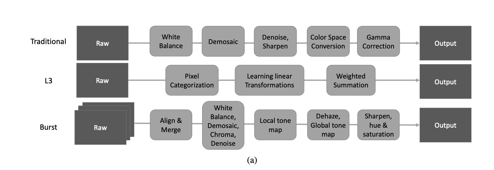
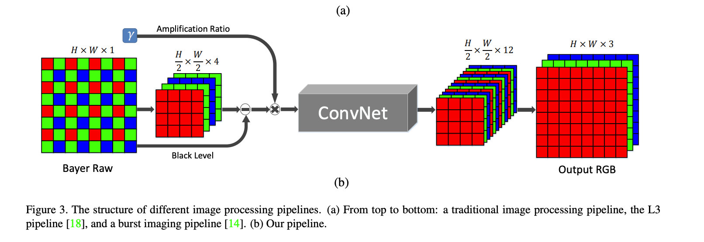
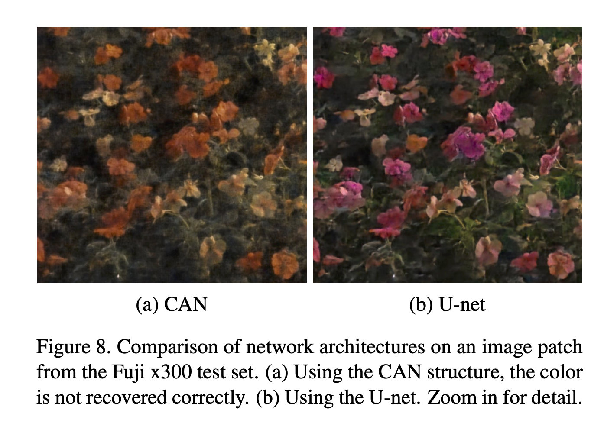
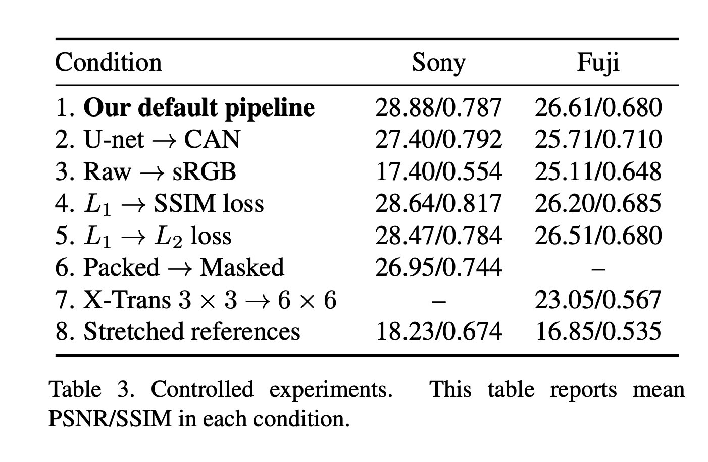
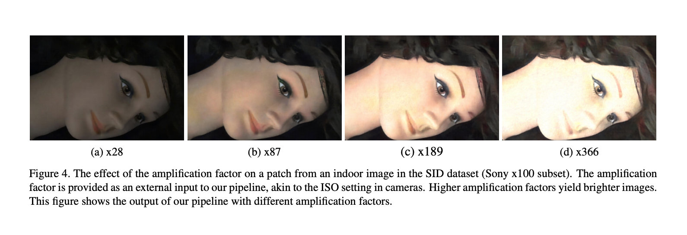
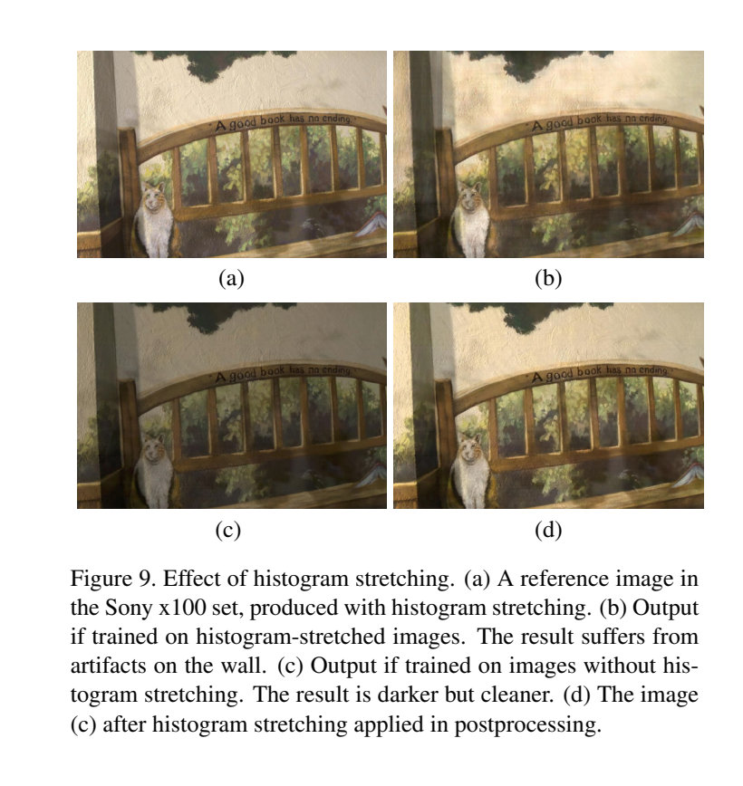
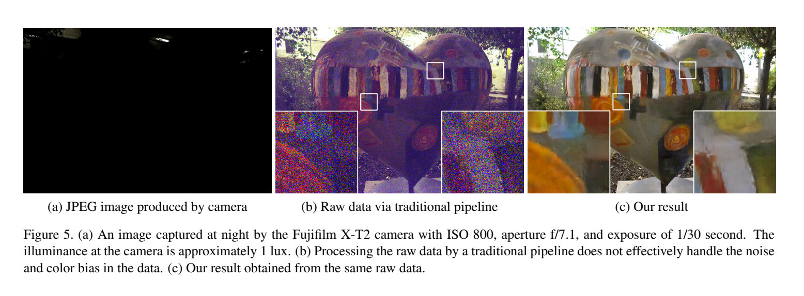
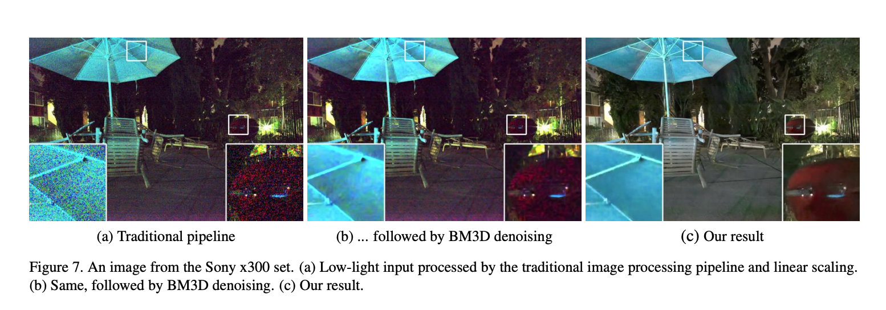
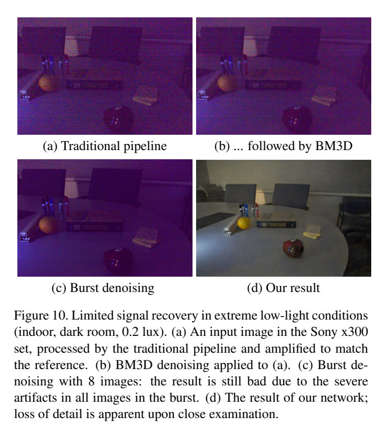

# Learning To See in the Dark CVPR2018

## 1. 摘要

日常拍照的各种场景中，低光照图片的画面质量往往都不够理想。其原因主要在于：黑暗条件下，光线较少，单张照片中捕获的光子较低，因此成像画面也较暗。

然而大多数情况下，我们还是希望得到暗光情况下的高质量照片的。从摄影学角度看，以下方法可以提升画面的光照：

1. 使用长时间曝光，通过延长曝光时间从而使得系统能够吸收到更多的光线，从而拍摄到清晰的照片；
2. 使用提高拍摄时候的系统的感光度（ISO）数值使得感光器件获取更多的光子；
3. 采用更大光圈值的光学镜头进行拍摄。

综上，基本方法是：使成像系统捕获的光子增多，实现更好的暗光成像效果。

但是现实场景中，并没办法很好的解决以上问题：

1. 使用长时间曝光仅可对静态物体进行拍摄，拍摄动态物体会产生模糊；
2. 提高系统感光度的方法取决于传感器的性能，仅仅是特定设备（如Sony的A7S系列、Nikon的D6系列等）的传感器才可以捕捉信噪比较高的画面；
3. 采用更大光圈的光学镜头拍摄，不仅价格昂贵，很多场景下也不适合一味提升光圈，不具有普适性。

因此，如果能够通过低光照图像，直接恢复出高光照图像，既是一种很有效的方法。本文正是从这个角度出发，尝试解决这个问题。

## 2. 相关工作

在低光照的情况下，图像系统的噪声的影响对于整个图像系统的成像效果影响非常大。一般的话，我们如果使用高的ISO感光度进行成像的话，的确可以提高整体的亮度水平，但是同时也会引入大量的噪声。

虽然可以通过很多预处理操作来进行预先处理尝试改善图像的质量，但因为其中光线实在是太少了，无法解决图像的信噪比低的现实问题。

对于这类问题，在计算摄影学中，有一个Fast Imaging的概念，即是专门考虑在较短的过程中完成成像过程。之前有一些工作，通过从图像去噪、图像去模糊、图像亮度增强等各个角度，对低光照图像进行增强。但是，这些方法对于输入图片仍然有一定要求：捕获的图像在暗光条件下，噪声不能太大。在未来我们将逐一介绍以上方法。

同时，作者还综合的review在2018年之前的噪声图像数据集。在当时，大部分的数据集都是采用人工合成的数据作为噪声数据的。比如在干净的GT图片上人工添加高斯噪声或是椒盐噪声。

RENOIR数据集尝试个基于真实噪声图像的评价数据集。但是，RENOIR数据集中间的数据不够可靠，也存在数据标注错误的问题。

谷歌的HDR+数据集，并没有针对于极端的低光照情况进行数据的采集，大多数的数据集之中的图像主要是在白天拍摄的。

还有DND数据集的话，本身是为了解决去噪社区对于真实噪声图片的需求，但是很多的图片也是在白天拍摄的，不适合对于低光照情况下进行参考。

今天介绍的文章，则是从另一个角度，尝试提出一种适用范围更广的方法，是现在极端低光照场景下，仅采用较低的曝光时间也能够实现较好的成像效果。

本文直接尝试采用一个端到端的卷积神经网络，直接从相机传感器的Raw文件入手，取代传统相机的ISP pipeline，直接实现低光照图片的增强。同时开源了一个低光照条件下的数据集，为开源社区做出了贡献。

## 3. See-In-the-Dark数据集

本文作者认为：传统的方法处理低光照图像效果没有想象中好的很多的一个原因是，使用的ground truth的图像是人工制作出来的，而不是真实现状的低光照片的。这里的话作者自己收集了一整套新的原始图像数据集RAW data，这里面的每一个低光照图片都有一个对应的长曝光高质量的参考图片与之一一对应。

这里的话高质量的图片主要采用的是延长曝光时间的方法（Introduction中的1方法），这里的话就需要要求保证环境的足够稳定。文章中采用了各种措施保证了拍摄时候的稳定性。对应的低质量图片采用的是长曝光时间的1/100-1/300进行拍摄的。

这里的话他们还为了适用性更强，采用了两种不同的cmos传感器结构形式（bayer阵列、富士xmos阵列）进行采集了两种数据集，一方面增强了整个pipeline的鲁棒性，另一方面也证明提出的方法等有效性（对任意一种相机cmos均可行）。

这里面的话是高清晰度的图像也不是完美的，这里面的高清晰度图像仍然存在着噪声。文章中写的是为了还原，也不排除为了今后的工作留一个可能的改进空间。

## 4. 实现方法

### 4.1 图像处理Pipeline

本文一大创新就是用CNN去代替传统的相机ISP处理过程。传统的详细处理过程是先要进行白平衡等操作，其中的话做了这些操作后效果并不一定好，而且这种图像处理流水线的方法主要只是适合于特定一种相机或一家相机厂商专门进行调校的，没有普适性。

L3方法，通过使用复杂的非线性滤波器对于得到的原始数据进行处理，从而估计实际的图像应该是什么样子。

Burst方法是iPhone现在用的计算摄影学方案，使用智能手机相机瞬间拍摄对张照片，然后通过把图像进行对其融合后，得到一张效果比较好的照片。这种方案需要非常高的定制化芯片来达到实时处理的目的。

本文中作者通过研究认为这两种方法都无法达到快速成像Fast-imaging的要求，同时对于低信噪比的图像处理效果不佳。

这篇文章则直接采用一个端到端的网络，不处理SRGB图像，而是直接对于传感器端的Raw数据进行处理。由于相机的传感器阵列排列的方式不同，对于不同的传感器采用了不同的方法把获取的各个通道的数据分别提取出来，然后对于空间分辨率都进行了压缩，长和宽都变成了原来的一半，这样子的话可以减轻处理的压力。

同时网络结构采用了U-Net结构。本文的网络设计在U-Net结构与多尺度上下文聚类网络CAN [1]进行了试验比较。比较结果如图：

本文通过了主观图像质量评价指标与客观图像质量评价指标对两种结构进行了比较，可以看出：

1. 在客观指标评价层面：UNet网络重建的图像有更高的PSNR数值；CAN网络重建的图像有更高的SSIM数值。
2. 在主观指标评价层面：如图8所示，CAN恢复的图像存在恢复图像颜色错误的情况。

除了通过实验选取了合理的网络结构外，本文还引入了放大系数来调节输出图像的亮度。这里图像的放大调节系数与相机Sensors的ISO设置高度类似。越大的放大系数会得到更亮的输出图片。

### 4.2 对比实验

Table.3 中还提供了其他重要的结论。

1. 经过对比可以发现，采用L1损失函数的得到的恢复图像远好于采用L2，SSIM损失函数得到的结果。同时，作者还实验了Total Variation损失函数以及GAN损失函数，发现这些方法重建图像的质量出现了明显下降。
2. Raw文件中的传感器数据所有的颜色都放置在了一个通道上，经过比较可以发现将不同色彩通道的值通过卷积神经网络分配到不同通道上的效果比在处理不同颜色时采用Mask的方法效果好。同时，富士相机的传感器与常规拜耳传感器的结果存在差异，经过实验发现，通过3* 3的Packing的结果比6* 6的Packing结果更好。
3. 在实验中，比较了将图像直方图进行stretching前和stretching后的结果，可以发现不需要对直方图预先做stretching处理。（如Fig.9所示）

### 4.3 其他试验结果

本文与其他方法进行了比较，比较结果如下：

实验结果展示出，提出的方法超越了当时的所有方法，而且完全是吊打级别的结果。

同时作者还将在Sony相机采集的数据集训练模型应用到了iPhone 6S的Raw图片上，可以看到这种方法也的确打败了iPhone默认的Pipeline。

## 5. 总结

本文研究了一个非常有意思的课题：Fast Imaging。这一个课题具有非常重要的现实意义，并且在2年后的今天，所有的智能设备都有了夜景模式，能在夜间拍出媲美低端单反微单质量的照片。这篇文章在2018年可能看起来并不起眼，但现在看起来是一篇非常领先的文章。当时作者提出的采用CNN网络直接替代已有的ISP的思想非常的大胆，但是通过了严谨的理论及实验证明了这种方法是可行的。在2020年的CVPR Workshop - NTIRE中，CNN-ISP也已经成为专门的一个研究方向，很多优秀的工作都直接尝试替代ISP来得到更高质量的输出图片。伴随着研究的发展，相信在未来手机替代沉重的单反并非不可能。

