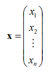

# 【数学知识拾贝】模式识别所需要的线性代数知识总结

【GiantPandaCV导语】本科期间只是将线代学了，并且通过做题拿到了一个不错的分数，但是掌握并不牢靠。到了研究生阶段以后，模式识别、机器学习、应用数学等课程都需要大量运用线代进行推导或者证明，线代知识的匮乏让我很吃力，所以借祝老师在模式识别绪论课程上展示的需要的矩阵相关的数学基础，在此总结、快速回忆。另外推荐一下3Blue1Brown的理解线性代数本质的视频，B站上有，讲解的非常形象，墙裂推荐。

[TOC]

## 1. 向量

**向量、标量**

标量：单个数值。

向量：多个成分构成的量。

- 向量也可以看作具有方向和长度的直线，也可以看作空间中的一个点，也可以用数值来表示。

表示：**x**, $\vec{x}$

列向量表示：

可加性&数乘：

**长度、夹角**

向量的模长、长度、范数
$$
|x|=\sqrt{x_1^2+x_2^2+\dots+x_n^2}
$$
等于与自身点积的平方根：
$$
|x|=\sqrt{x\centerdot x}=\sqrt{x^2}=\sqrt{x^Tx}
$$
以上都是等同表示。

**点积**
$$
x\centerdot y=|x| |y| cos\theta=xycos\theta
$$
$\theta$就是两个向量之间的夹角。       

**点积的柯西不等式**(Cauchy-Schwarz)

**正交向量**

两个向量之间角度为90，$cos\theta=cos90=0$
$$
x\centerdot y=0
$$
**单位向量**

$|x|=1$

**直线、平面、超平面的线性表示**

## 2. 矩阵

矩阵是标量数排列而成的。

矩阵可以代表一个线性变换，可以用来描述线性系统，矩阵的描述可以让公式变得简单。

**索引**

具体索引示意图：

**矩阵加法&数乘运算**

**矩阵乘法**

> from 3Blue1Brown:
>
> 矩阵可以看作几个基，这样就可以将矩阵看作线性变换，比如旋转、 平移、平切等操作。
>
> 这样就能理解为什么：$M_1M_2\ne M_2M_1$
>
> 因为线性变换的顺序改变。

**子矩阵划分**

## 3. 矩阵与向量

 

**矩阵乘与点积**

这部分比较重要，在svm中的基础表示中经常用到。

## 4. 矩阵代数

**转置** 行列互换

转置公式：
$$
(AB)^T=B^TA^T
$$
**主对角线**:从左上角到右下角。

**对称矩阵**：关于主对角线对称的矩阵。

对阵矩阵的转置是其自身。

**对角矩阵**： 

**单位矩阵：** 对角矩阵中对角线上的值全部为1, 单位矩阵的表示为$I$

单位矩阵和矩阵相乘：$AI=IA$

## 行列式

行列式是矩阵的一个重要的属性，被记为：$|A| \text{ or } ||A||$

行列式计算方法：

**余子式和余因子**

 A*代表的是伴随矩阵。

**矩阵的逆**

**正交矩阵**

**特征分解**

**x**就是一个**特征向量**，$\lambda$是**特征值**。

 

**SVD分解**

 

SVD分解可以用于降维，进行近似计算。

 

