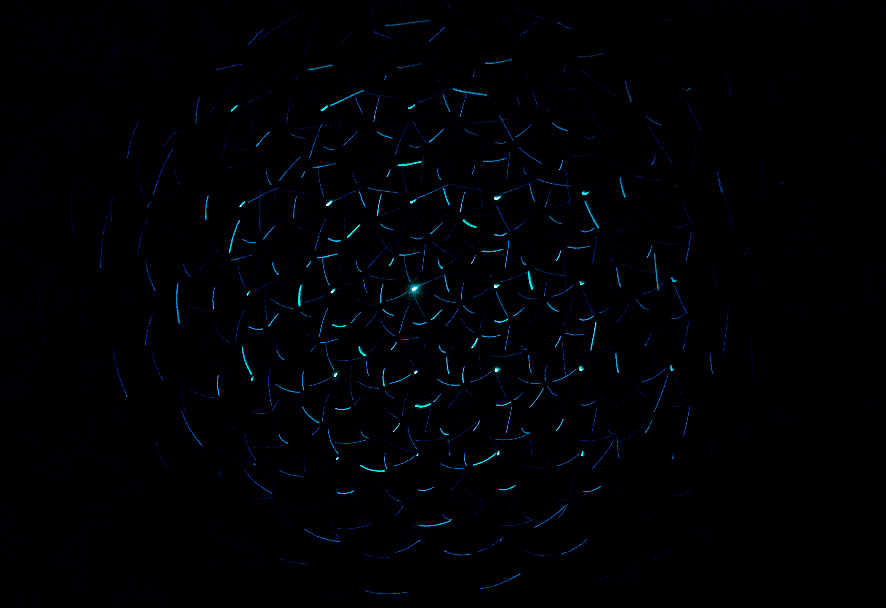
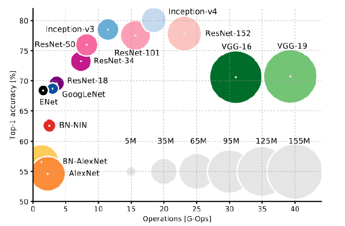
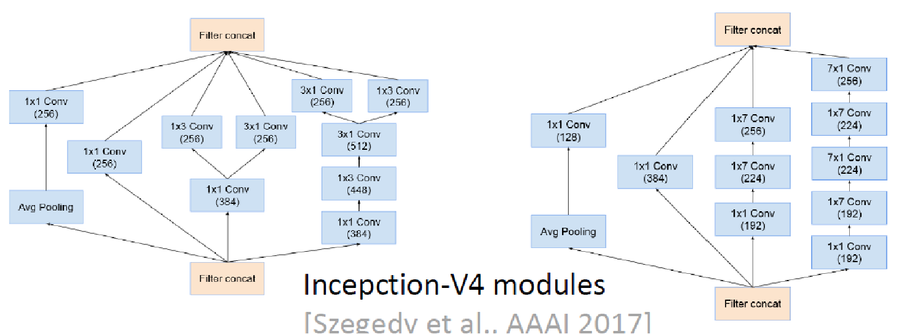

<!--
_class: lead gaia 居中
_paginate: false 右下角码
-->

# 可微结构搜索(DARTS)及其改进工作

 报告人：赵杨
 时间：2020年3月11日

---

# 1. 内容

- 问题背景
- 简要过往研究总结
- DARTS(Differential ARchiTecture Search)
- DARTS的缺点、改进及同期工作
- 可能的方向

---

# 2. 问题背景

简要过往研究总结

---

# 问题背景

---

# 问题背景

网络越来越深,单元结构越来越复杂

---

## 问题背景

<!--
_class: lead
-->

我们能否将设计神经网络的工作自动化呢？

Neural Architecture Search, NAS

---

## 简要研究总结

- 两个重要的子问题
  - 搜索空间
  - 搜索方法

---

## 搜索空间

