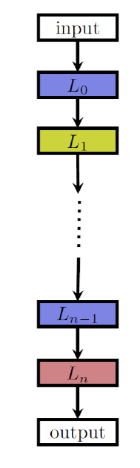
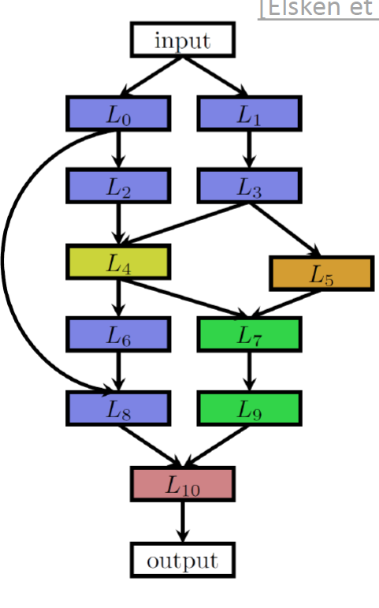
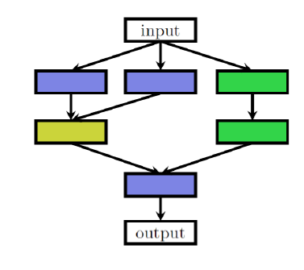
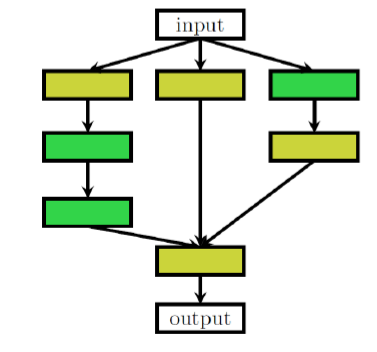
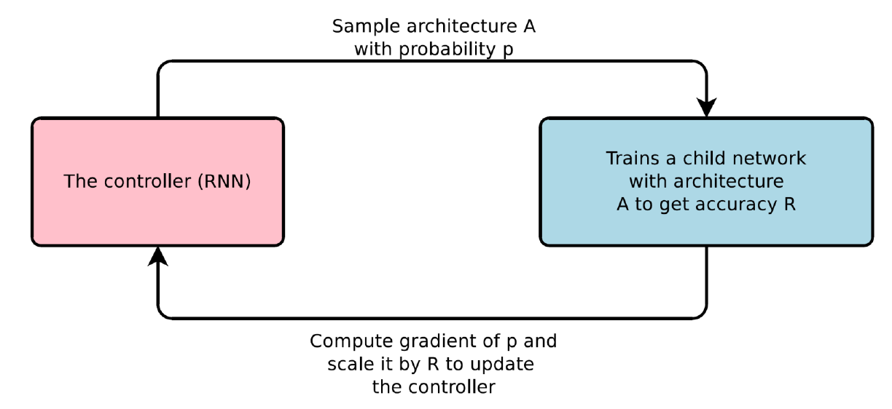
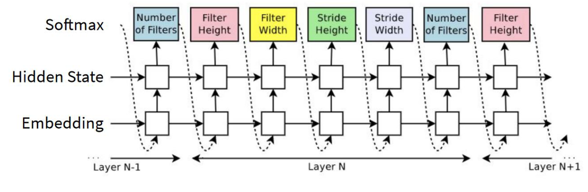
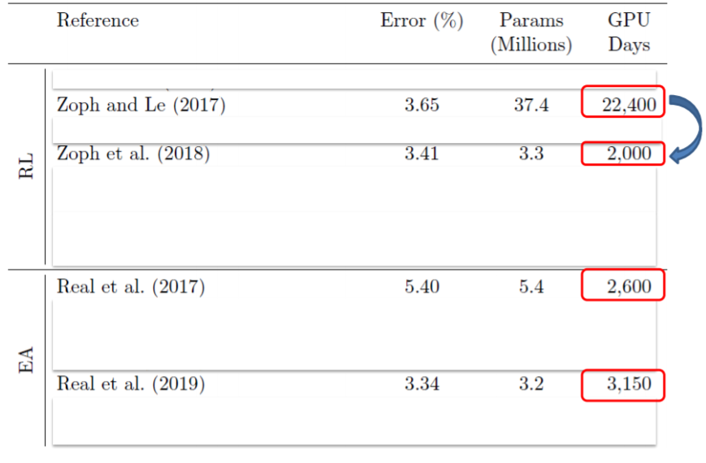
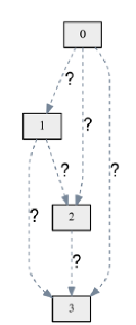

<!--
_class: lead gaia 居中
_paginate: false 右下角码
_size: 4:3
-->

# 可微结构搜索(DARTS)及其改进工作

 报告人：赵杨
 时间：2020年3月11日

---

# 1. 内容

- 问题背景
- 简要过往研究总结
- DARTS(Differential ARchiTecture Search)
- DARTS的缺点、改进及同期工作
- 可能的方向

---

# 2. 问题背景

简要过往研究总结

---

# 问题背景

---

# 问题背景

网络越来越深,单元结构越来越复杂

---

## 问题背景

<!--
_class: lead
-->

我们能否将设计神经网络的工作自动化呢？

Neural Architecture Search, NAS

---

## 简要研究总结

- 两个重要的子问题
  - 搜索空间
  - 搜索方法

---

<!--
_class:lead
-->

# 搜索空间

链式结构

---

# 搜索空间

有向无环图结构

---

# Hex color (White BG + Black text)

---

# Named color (rebeccapurple BG + White text)

---

# RGB values (Orange BG + White text)

)
)

---

# 搜索空间

- Normal Cell
- Reduction Cell

---

# 简要总结

- 两个重要的子问题
  - 搜索空间
    - 全局搜索
    - 单元搜索
  - 搜索方法
    - 基于强化学习
    - 基于进化学习
    - 基于贝叶斯优化

---

# 基于强化学习的方法

---

## 搜索方法实例

---

## 在CIFAR-10上的准确率与效率

---

## 提速技巧

- 搜小搜索空间
  - Hierarchical representations for efficient architecture search. (2018 ICLR)
- 网络性能预测
  - Smash: one-shot model architecture search through hypernetworks (2018 ICLR)
  - Accelerating neural architecture search using performance prediction.(2018 ICLR W)
- 权值共享/继承
  - Efficient architecture search by network transformation. (2018 AAAI)

---

<!--
_class: lead
-->

## 根本原因

将问题定义为 
在离散空间上的 黑盒优化问题

---

## DARTS

形象描述
单元搜索
CNN 或 RNN
Normal cell 或 Reduction cell

点表示向量0,1,2,3……
边表示网络操作
Conv3x3
Conv5x5
Skip-connect

---

## 数学描述

$$
o^{(i,j)}=argmax_{o\in O} \alpha_{o}^{(i,j)}
$$